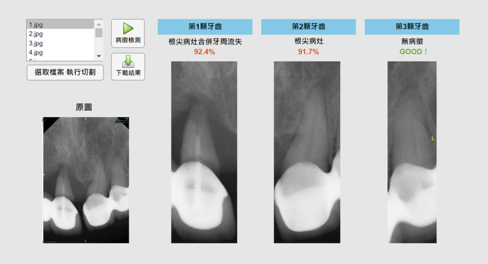

## 牙齒病徵辨識系統

#### 研究主題名稱：基於卷積神經網路與YOLOv8物件偵測辨識根尖病灶合併牙周流失 Recognizing apical lesion and peri-endo combined lesion based on convolutional neural network and YOLOv8 object detection

#### 一、合作對象
本研究與桃園長庚醫院進行跨領域的合作，獲得長庚醫療財團法人人體試驗倫理委員會的認可，IRB 編號202301730B0。資料庫已經過 IRB 認證，試驗期間為2023年12月4日至2026年12月3日。

#### 二、研究動機與目標
透過基於卷積神經網路與物件偵測技術建立口腔病徵辨識系統，以達到自動檢測並分類有病與無病的牙齒。以根尖病灶、根尖病灶合併牙周流失作為目標病徵進行自動化辨識。本研究所提出之目標與宗旨於以下列出：
1. 更適合病徵的影像增強技術：針對根尖病灶與根尖病灶合併牙周流失兩項病徵做適切的影像強化與處理，如：灰階技術、濾波器、自適應直方圖均衡化，有助於提高病徵檢測的成功率。
2. 更先進的影像切割技術：引入YOLOv8定向邊界框技術，以更精確地標記牙齒位置，提高牙科影像檢測的準確性，尤其是在處理不規則方向的牙齒時。
3. 多種CNN模型的對照實驗：進行AlexNet、VGG-16、ConvNeXt的對照實驗，比較三種不同模型在牙齒病徵辨識上的性能。這有助於確定本研究所提出方法的相對優勢和應用價值。
4. 更靈活和高效的目標偵測：使用較新的YOLOv8技術，以達到優秀的準確率表現。
5. 快速而可靠的診斷支援：搭載直觀的人機互動介面，輔助醫生在早期即時發現檢測口腔問題，並在治療過程中輔佐醫師判斷病灶是否有完全根除，減少醫師繁瑣工作，提高臨床效率，實現智能診斷，推動牙科醫學進步。

關鍵字：CNN、物件偵測、YOLOv8、影像切割、根尖病灶合併牙周流失、根尖X光片、牙齒疾病識別、影像增強、高斯高通濾波器、自適應直方圖均衡化、深度學習

#### 三、使用技術
1. python：影像切割;影像預處理;影像強化;實做ConvNeXt模型。
2. MATLAB：實作多5種CNN模型，如：AlexNet、VGG-16等;實做CNN可視化。
3. 深度學習技術：使用影像分類的卷積神經網路模型與目標偵測的YOLOv8 OBB定向邊界框模型，實現病徵辨識之目標。

#### 四、研究方法
針對兩項病徵（包括根尖病灶和根尖病灶合併牙周流失）進行AI病徵檢測。將分為四部分：影像切割、影像處理、卷積神經網路CNN、物件偵測。旨在確保模型能夠精確且有效地辨識出病徵，從而提升檢測的準確性與效率。
 

#### 五、研究結果

##### 1.CNN影像分類
使用多個CNN模型進行實驗，包括AlexNet、VGG-16和ConvNeXtv2。這三種模型將進行對比和評估，以找到達到最高準確率的最佳模型，成為最終的病徵辨識模型。同時，我們進行了超參數調整、防止過擬合技術的應用以及評估指標的選擇，以最大程度地優化和評估模型的性能，以確保模型訓練結果達到期望的水準。
  
該部分已經進行多次實驗，驗證準確率如以下表格。其中，AlexNet在經過黑色填充、資料擴增並使用高斯高通濾波器和自適應直方圖均衡化達到最優準確率為93.33%。接下來，會持續嘗試各種組合，增加資料集數量，調整模型，以找出最佳組合和訓練方法。
  

 

 

- A：原圖（輸入CNN會變形為224*224的正方形尺寸）
- B：原圖進行黑色填充防止變形，可提高3 ~ 11% 準確率
- C：B經過資料擴增 (訓練集564張/驗證集240張) ，可提高2 ~ 4 % 準確率
- D：C單顆牙齒裁剪範圍水平外擴20 pixel與垂直外擴40 pixel，可提高約1.1 %準確率
- E：C經過高斯高通濾波器與自適應直方圖均衡化，可提高約2 ~ 7% 準確率

 

 

  

##### 2. YOLOv8物件偵測
使用YOLOv8進行根尖片的讀取並直接進行物件偵測，將圖像中的數顆牙齒進行分類，從而優化訓練過程的繁瑣性，省略了切割單顆牙齒和訓練集分類的步驟。除了物件偵測之外，YOLOv8具有三大值得採用的優勢：新卷積層（與YOLOv5不同）、無錨檢測（Anchor Free Detection）和定向邊界框（Oriented Bounding Box）。特別是定向邊界框是決定性的依據，能夠精確框出影像中不同方向和角度的牙齒，避免邊框重疊的情況，從而提高檢測和分類的準確率。預測結果如圖。

 

 
此部分已經進行過試驗，表格呈現了在不同預處理下的訓練成果。經過高斯高通濾波和自適應直方圖均衡化的原圖，為目前最平衡且最優的版本。三個分類的mAP50能夠穩定在0.9左右，而總體的mAP50達到0.899，準確率為88.46%。

  

 

 

- A：原圖經過資料擴增(訓練集 362張/驗證集30張)
- B：A經過高斯高通濾波與自適應直方圖均衡化

#### 六、人機介面
預計開發圖形使用者介面，以方便使用者進行操作，如圖九所示。該介面將設有三個按鈕，用以實現病徵檢測的功能：

- 「選取檔案 執行切割」：用於選取並切割X光片影像。
- 「病徵檢測」：用於將每顆牙齒影像輸入模型進行病徵辨識。
- 「下載結果」：用於下載病徵檢測的結果。

 

 